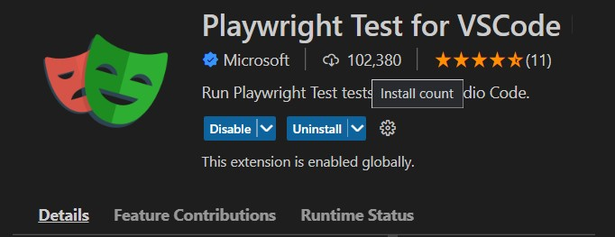
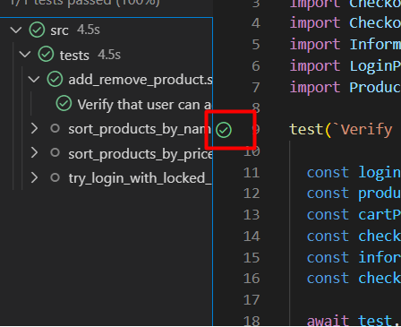
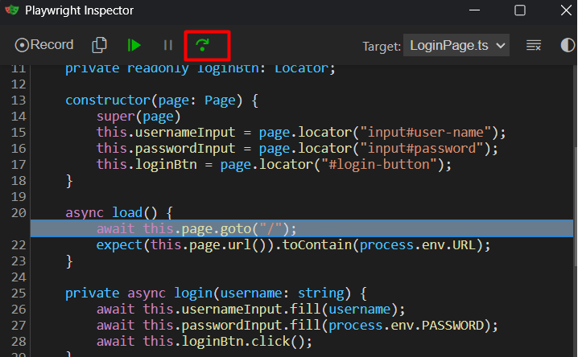

# `Web Automation Task Solution`

## `Software Under Test (SUT)`

- The web app to be tested in this framework is [SauceDemo](`https://www.saucedemo.com`) which is built for testing purposes.

## `About Framework`

This test automation framework is built using :

- Playwright (latest) (https://playwright.dev)
- Typescript (https://www.typescriptlang.org/docs/)

The reasons why Playwright and Typescript are used :

- TypeScript provides static type checking, which can help catch bugs and errors at compile time rather than runtime. This can make it easier to write reliable and maintainable code.
- Playwright :
  - has a simple and intuitive API that makes it easy for developers to write and maintain tests. This can save time and effort compared to other testing frameworks that may be more complex to use.
  - is able to interact with web pages in the same way that a user would. This allows for more realistic and comprehensive testing of web applications.
  - has web-first assertions, auto-waiting until element is visible, clickable contrary to Selenium webdriver
  - has capability to open new tabs and windows contrary to Cypress

So, the factors below have been taken into consideration while building this test automation framework :

- Code reusability and readability
- Avoiding from unnecessary repeats of code.
- Code maintainability
- Page Object Model has been used to ensure these as well.

## `Setup`

- You need to have the followings already installed in your machine whether it is MacOs, Linux or Windows :
  - `Nodejs` (v16+ is recommended)
  - `Visual Studio Code` or another IDE you prefer to do the same jobs
- To install and use this test automation framework, please follow the steps below:
  - Open `Web-Automation-Solution` folder with Visual Studio Code
  - Open `terminal` from VS code (you can do this by opening a terminal from the directory of the folder but VScode will be used for other steps as well)
  - Run this command to install dependencies/external libraries of the project
  ```bash
          npm install
  ```

## `File/Folder Structure`

`package.json` : As you know, project dependencies, scripts(commands), name, author, version information etc are kept and configured with this file.

`tsconfig.json` : As you may know, this is a general configuration file for Typescript language in the project.

`playwright.config.ts` : This file contains various Playwright configurations either general or specific. There are some explanations inside the file (also for more details : https://playwright.dev/docs/test-configuration#global-configuration)

`.env` : This file is created to hold environmental variables and is read with the help of `dotenv` library installed.

Under `src` folder, there are three folders

- `pages` : contains page classes for holding web element and related method definitions.
  - `BasePage` is the parent class of other page classes and it has some common web elements, variables and methods (if any) used in the child page classes.
- `tests` : contains test scenarios and scripts for each 'validation' described in the task readme file.
  - Test files have been named related to 'validations' in task readme file. Test files have `.spec.ts` extension
- `utils` : contains some classes I created and used in some methods.

There are also folders and files generated after test executions :

- `playwright-report` : contains playwright html test report file which is automatically generated by playwright. You can use `npm run report` command to see the report later as well.

- `out` : this folder is the output folder for test runs:
  - `test-results` : contains only the screenshot and video of failing tests. You can turn the setting off in the playwright.config.ts file.

## `Developing Tests`

Playwright provides a test function to declare tests.

To write and code new test scenarios, you can create a new test file with this naming pattern `**.spec.ts` under `src/tests` folder. Or you can add a new Playwright `test` method to an existing test file and fill it with steps you want to code.

You can see how the test files are written and write your code similarly or check [this link](https://playwright.dev/docs/writing-tests) out.

## `Running and Executing Tests`

Tests are located under `src/tests` folder. Options to run tests:

- To run all tests :
  ```
      npm test
      or
      npm run test
  ```
- To run a specific test, you can append a substring/word that is present in the test file name you want to run to the test command as in the examples below:
  ```     npm test add_remove
        npm test by_name
        npm test by_price
        npm test sort
        npm test login_with_locked
  ```

Note : Another way of running tests is to install VSCode extension of Playwright (we don't have to install and use it):
    

If you install the extension, you will see a green button when you open test files. After you click that, that test will be executed :

  

- To debug test(s) step by step visually, you can run:
  ```
      npm run debug add_remove
  ```
  after you run this command, a separate Playwright Inspector popup will be opened together with the browser window. You can debug step by step, clicking the green button in the red square below:
  

for more information about running/debugging tests : https://playwright.dev/docs/writing-tests

## `Automated Test Scenarios`:

### [Scenario 1 : Add/remove product from/to cart](./src/tests/add_remove_product.spec.ts) :

- Log in as a `standard user`
- Find an item by name, then add it to the cart
- Find a second item by name, and add it to the cart as well
- Go to the cart
- Find an item by name, then remove it from the cart
- Validate in the Checkout Overview that:
  - It only contains the items that you want to purchase
  - The Item Total is right
- Finish the purchase
- Validate that the website confirms the order

### [Scenario 2 : Sort products by name](./src/tests/sort_products_by_name.spec.ts):

- Log in as a `standard user`
- Sort products by name
- Validate that the sorting is right

### [Scenario 3 : Sort products by price](./src/tests/sort_products_by_price.spec.ts):

- Log in as a `standard user`
- Sort products by price
- Validate that the sorting is right

### [Scenario 4 : Log in with 'locked out user'](./src/tests/try_login_with_locked_user.spec.ts):

- Log in as a `locked_out_user`
- The validation should fail
- Add capabilities to your program so it can create reports with screenshots when something fails

## Challenges

Generally, while automating web scenarios, testers encounter with synchronization issues and put waits for web elements. In Playwright, auto-waiting solves most of the challenges. Therefore, I haven't encountered any challenge while automating or coding.